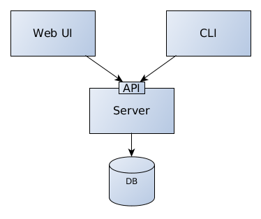

# Operational/Administrator Manual

## Architecture and Components



### Server

Zally Server is the core of Zally tools and also the only component of the minimal
setup. It provides a
[well-defined RESTful API](../server/src/main/resources/api/zally-api.yaml) to
lint APIs, get information about past lintings, as well as provide information
about implemented rules and statistics.

Optionally, you can connect Zally Server to a persistence layer, e.g. a PostgreSQL
database. Per default, a in-memory database is provided automatically.

#### Remote URL linting
Zally is able to lint API specifications resolved by a given Web URL - we call that Remote URLs.
When you want to lint OAuth 2.0 protected resources, you need to configure the credentials in the
remote-urls.conf file. You can find the template file for Remote URL configuration at
```server/zally-server/src/main/resources/remote-urls.conf```. You can use the environment variable
```REMOTE_URLS_CONFIG_FILE``` to configure the path to the configuration file on the server. In
k8s contexts, we mount the file as a config map to the given path.

### Web UI

The most intuitive and easy way to use Zally is to set up and run Zally Web UI.
It provides a web interface to lint APIs and uses Zally Server to do the actual
linting.

### CLI

Zally CLI is a tiny tool written in Go which wraps HTTP calls to Zally Server.
It's a tiny binary which can be distributed easily to use in different environments
like local developer's machine, continuous delivery platforms, etc.

## Technical Dependencies

- JDK 1.8+ for Server
- Golang 1.7+ for CLI
- Node.js 7.6+ for Web UI
- (Optional) PostgreSQL database for Server
- (Optional) Docker if you want to containerize

## Build and Run

Please see the respective readmes for more details on how to build the components:

- [Server](../server/README.md)
- [Web UI](../web-ui/README.md)
- [CLI](../cli/README.md)

In general, there are 3 options to start a component:

1. With the build tool (Gradle, Yarn)
2. Build the source > start the bundle/jar/binary
3. Build the source > build Docker image > run Docker container