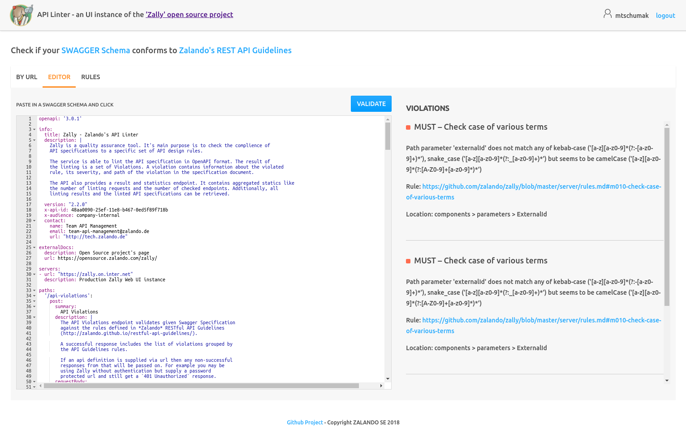

# User Manual

## Zally RESTful API (Zally Server)

In order to lint an API specification you just have to send a HTTP `POST` request
to a running instance of Zally Server. Here is a request example:

```bash
curl -X POST \
  -H "Content-Type: application/json" \
  --data "{\"api_definition_string\": \"${api-specification}\""
    ${zally-server-base-url}/api-violations
```

And here is a response example:

```json
{
  "external_id": "9b26b489-8ccf-4a2f-be13-5b541ef543bd",
  "message": "",
  "violations": [
    {
      "title": "Use Semantic Versioning",
      "description": "Semantic versioning has to be used in format MAJOR.MINOR(.DRAFT): version is missing",
      "violation_type": "MUST",
      "rule_link": "https://zalando.github.io/restful-api-guidelines/#116",
      "paths": [
        "/info/version"
      ],
      "pointer": "/info/version",
      "start_line": 1,
      "end_line": 1
    }
  ],
  "violations_count": {
    "must": 1,
    "should": 0,
    "may": 0,
    "hint": 0
  }
}
```

Please consult
[Zally API specification](../server/src/main/resources/api/zally-api.yaml).
for further information. The well-defined API explains various linting variants
and usage of other features like permalinks to results, statistics, etc.

## Web UI

Zally Web UI is the most intuitive way of using Zally. The user interface is self-explaining.



## CLI

You can download Zally CLI from the
[release page](https://github.com/zalando/zally/releases).
After unpacking and adding the binary to the `$PATH` you can lint an API specification
by typing:

```bash
zally \
  --linter-service ${zally-server-url} \
  --format pretty \
  lint ${api-file}
```

You can also list supported rules by executing `zally rules`.

See `zally --help` for more information.